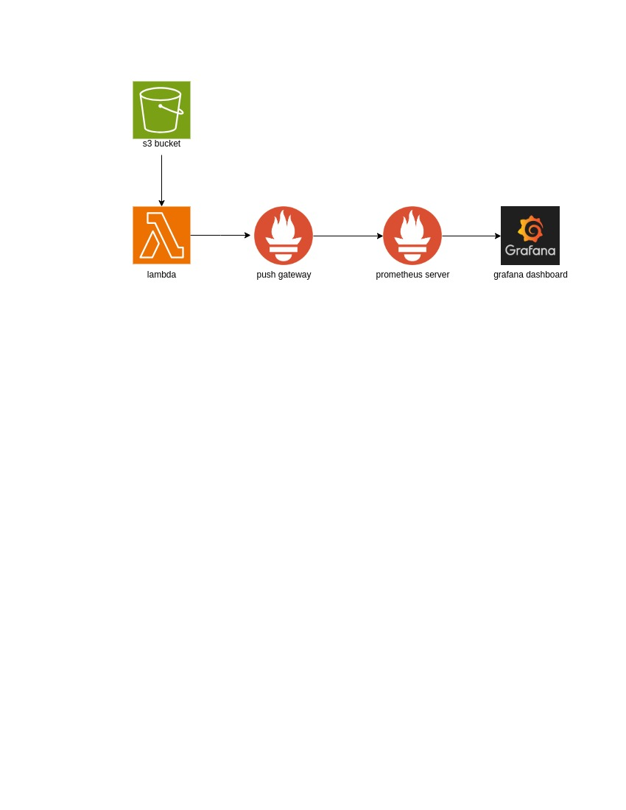

# Overview

The lambda function top_5_expensive_services and resource_breakdown uses the AWS Cost and Usage Report to find the 5 most expensive services in a provided AWS region and the resources and its associated cost for the selected services respectively. This code is intended to be used as an AWS Lambda function, and it uses the Prometheus client library to push the data to a Prometheus Push Gateway.

The script imports several libraries at the top, including json, boto3, os, logging, date, timedelta,pandas, and prometheus_client.

# Purpose

The script retrieves the latest Cost and Usage Report from an S3 bucket, processes the data to identify the top 5 services by cost, and pushes metrics to a Prometheus Push Gateway.

# Working

The script starts by initializing the necessary library and making boto3 connection to the S3 and retrieves the environment variable.

The script defines a lambda_handler function that takes two arguments: event, and context. It then gets the latest CUR report from the s3 bucket and read its contents using the pandas library.

Then, it uses pandas library to get the cost and usage data filtering by the SERVICE and RESOUURCEID dimension. It sorts the services by their costs and takes the first 5 services.

It then uses the Prometheus client library to create a gauge for the data, setting the labels for the gauge with the service,resource, name, cost, region, and account ID. Finally, it pushes the gauge data to a Prometheus Push Gateway, defined by the prometheus_ip environment variable. The function returns a JSON response indicating whether the metrics were pushed successfully or not.

## License

Copyright (c) 2023, Xgrid Inc, https://xgrid.co

Licensed under the Apache License, Version 2.0 (the "License");
you may not use this file except in compliance with the License.
You may obtain a copy of the License at

       http://www.apache.org/licenses/LICENSE-2.0

Unless required by applicable law or agreed to in writing, software
distributed under the License is distributed on an "AS IS" BASIS,
WITHOUT WARRANTIES OR CONDITIONS OF ANY KIND, either express or implied.
See the License for the specific language governing permissions and
limitations under the License.

